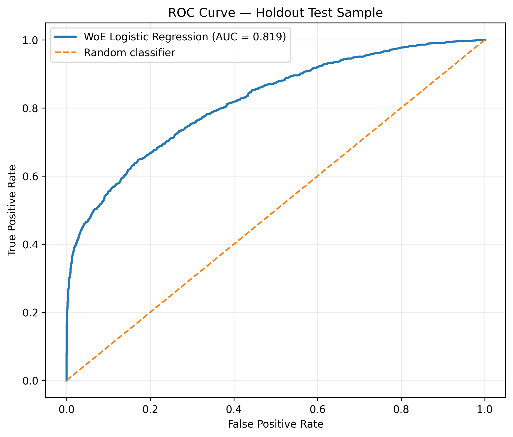
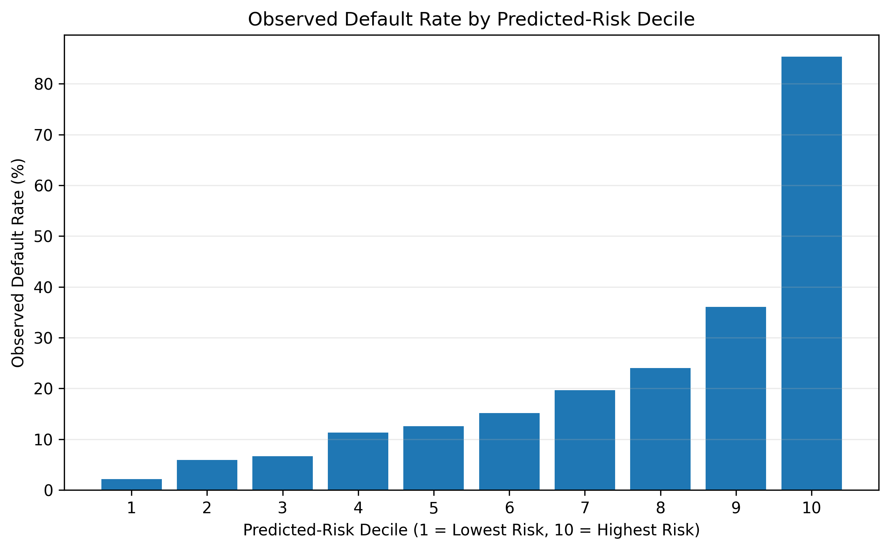
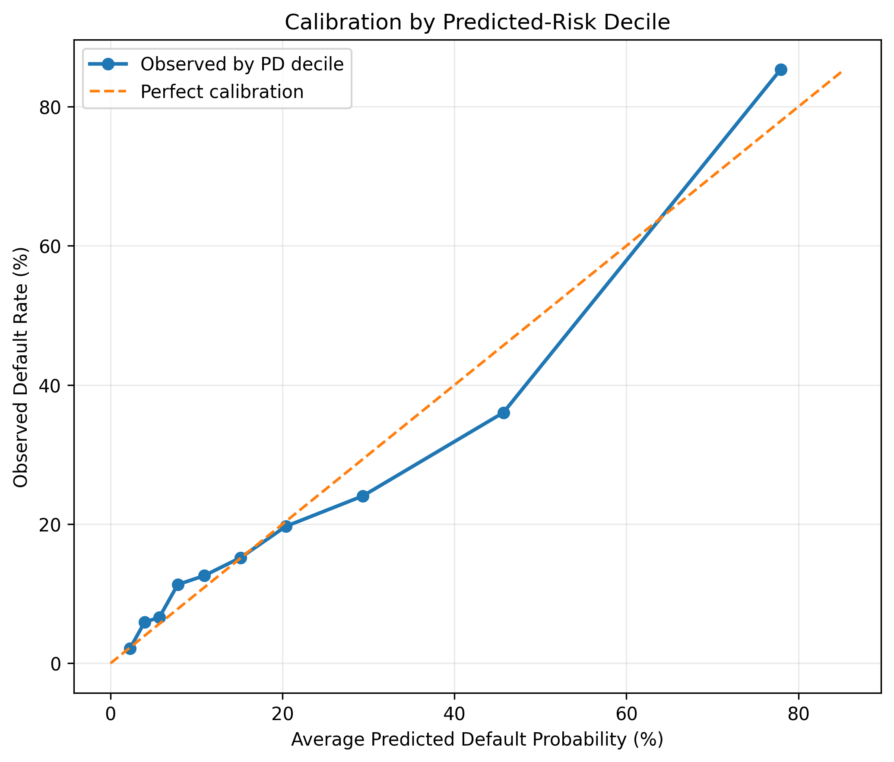
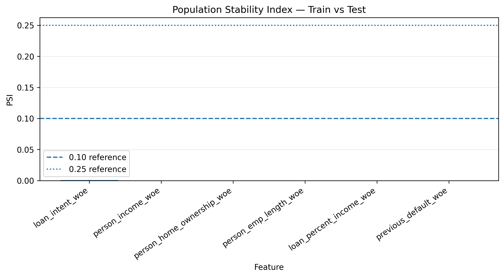

# Credit Risk Modeling — Probability of Default

An interpretable credit-risk modeling project using Weight of Evidence (WoE) transformation and Logistic Regression to estimate the probability of an observed borrower default outcome.

> **Scope:** This is an educational project based on a public dataset. The target variable is treated as an observed default outcome and does not represent a regulatory definition of default. The model is not a Basel / IFRS 9 regulatory PD model or a production credit-decision system.

## Project Overview

The project covers the credit-risk model development workflow from data quality assessment and exploratory risk analysis through WoE/IV transformation, feature selection, model validation, sensitivity analysis, monitoring design, and reproducible scoring.

After data-quality filtering, the modeling dataset contains **32,409 observations**.

An **80/20 stratified train-test split** was used, with an observed default rate of approximately **21.9%** in both samples.

## Modeling Workflow

1. Data audit and cleaning
2. Credit-risk exploratory analysis
3. Stratified train/test split
4. Weight of Evidence (WoE) transformation
5. Information Value (IV) analysis
6. Feature selection and redundancy review
7. Logistic Regression modeling
8. Default-probability estimation
9. Discrimination and calibration testing
10. Risk-decile and default-capture analysis
11. Sensitivity analysis
12. PSI-based monitoring framework
13. Model serialization
14. End-to-end scoring validation

## Final Model

The final specification is a **6-feature WoE Logistic Regression** using:

- Loan-to-income ratio
- Borrower income
- Home ownership
- Previous default indicator
- Loan intent
- Employment length

Interest rate and loan grade were excluded from the primary specification and retained for sensitivity analysis because they may contain information related to pricing or existing underwriting decisions.

## Model Performance

Holdout test performance:

| Metric | Result |
|---|---:|
| ROC-AUC | **0.819** |
| Gini | **0.638** |
| KS Statistic | **0.476** |
| Brier Score | **0.1174** |
| Average Predicted Default Probability | **21.89%** |
| Observed Default Rate | **21.88%** |

The model achieved approximately **31.3% improvement in Brier Score** relative to a constant base-rate predictor.

### Model Validation
#### ROC Curve

#### Risk Decile Analysis

#### Calibration Plot

## Risk Ranking

Observed default rates increase across predicted-risk deciles.

- Highest-risk **10%** captured approximately **39.1%** of observed defaults.
- Highest-risk **20%** captured approximately **55.4%**.
- Highest-risk **30%** captured approximately **66.4%**.

These results are risk-ranking diagnostics and are not presented as credit approval or rejection rules.

## Calibration

Average predicted default probability on the holdout sample was **21.89%**, compared with an observed default rate of **21.88%**.

Calibration varies across individual risk deciles, particularly in higher-risk segments. Portfolio-level agreement therefore should not be interpreted as perfect calibration throughout the risk distribution.

## Sensitivity Analysis

| Specification | Test ROC-AUC | Test Gini |
|---|---:|---:|
| Main model | 0.8190 | 0.6379 |
| Main + interest rate | 0.8679 | 0.7358 |
| Main + interest rate + loan grade | 0.8815 | 0.7631 |

Interest rate and loan grade improve discrimination but were not included in the main specification because they may reflect pricing or pre-existing underwriting information.

## Monitoring Framework

The project demonstrates monitoring using:

- PSI for population stability
- ROC-AUC, Gini and KS for discrimination
- Observed default rates by risk decile
- Predicted versus observed default rates
- Brier Score
- Portfolio average predicted default probability

Train-vs-test PSI values were below **0.001** across all final-model features.

Because the validation split is random rather than time-based, these PSI results demonstrate the **monitoring methodology only** and should not be interpreted as evidence of temporal stability.
### Population Stability Index (PSI)

## Reproducible Scoring

Final serialized artifacts:

- `models/model_features.pkl`
- `models/preprocessing_artifacts.pkl`
- `models/woe_logistic_regression.pkl`

The preprocessing artifact stores the fixed numeric bins, WoE mappings, feature order, target information, and WoE convention.

End-to-end scoring validation reproduced the original holdout results exactly:

- Maximum WoE feature difference: **0.0**
- Maximum PD difference: **0.0**

## Repository Structure

- `data/` — dataset documentation
- `figures/` — model validation visualizations
- `models/` — serialized model and preprocessing artifacts
- `notebooks/01_credit_risk_modeling.ipynb` — complete model-development notebook
- `outputs/` — validation tables and model-development outputs

## Limitations

- The project uses a public dataset that may not represent a current bank lending population.
- Validation uses a random holdout rather than an out-of-time sample.
- `loan_status` is treated as the observed default outcome rather than a regulatory definition of default.
- Interest rate and loan grade may contain existing underwriting or pricing information.
- Calibration varies across individual risk deciles.
- The project focuses on an interpretable WoE Logistic Regression rather than an exhaustive challenger-model benchmark.
- This is an educational credit-risk modeling exercise, not a Basel / IFRS 9 regulatory PD model.

## Tools

Python · pandas · NumPy · scikit-learn · Matplotlib · Jupyter Notebook

## Author

**Phat Thanh Nguyen**

B.Sc. Applied Mathematics — Financial Engineering & Risk Management  
International University — Vietnam National University HCMC